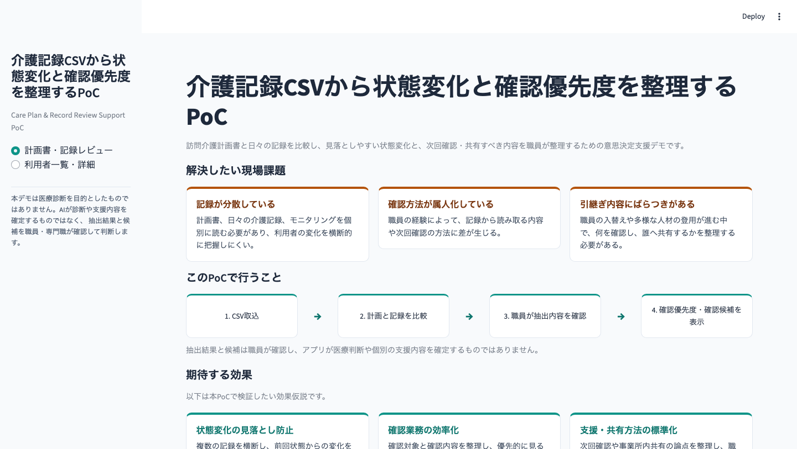
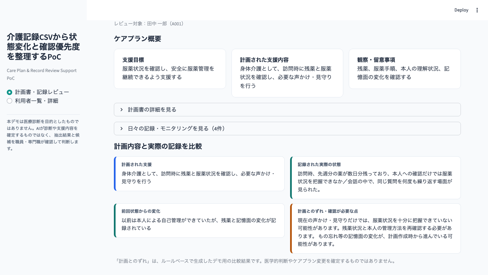
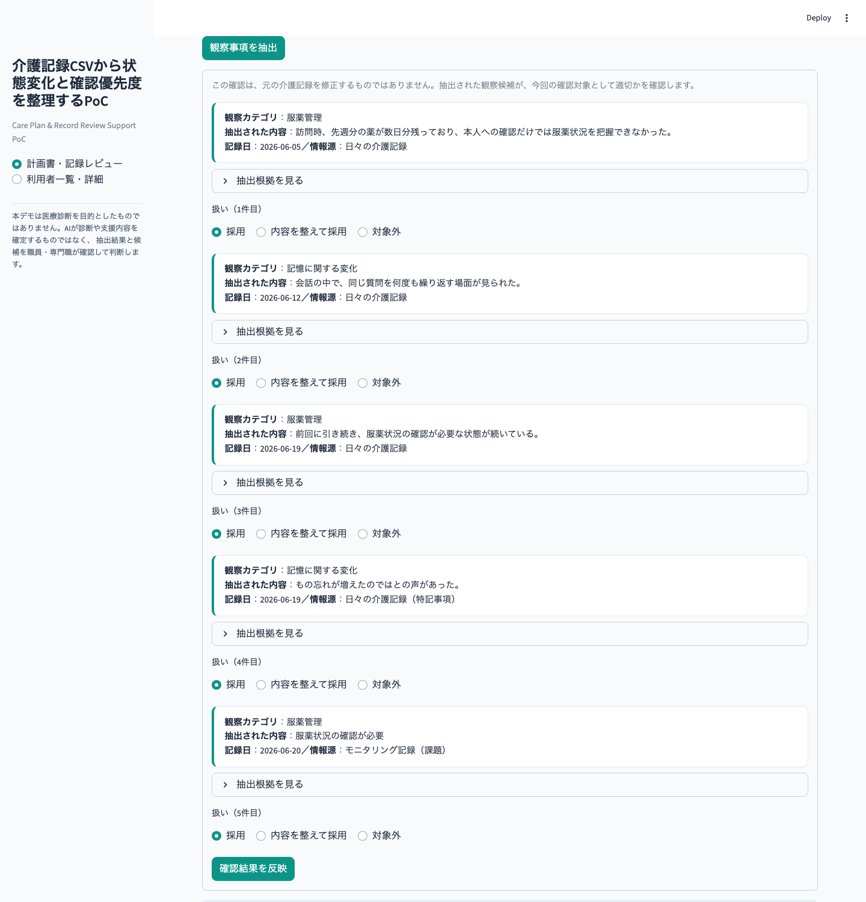
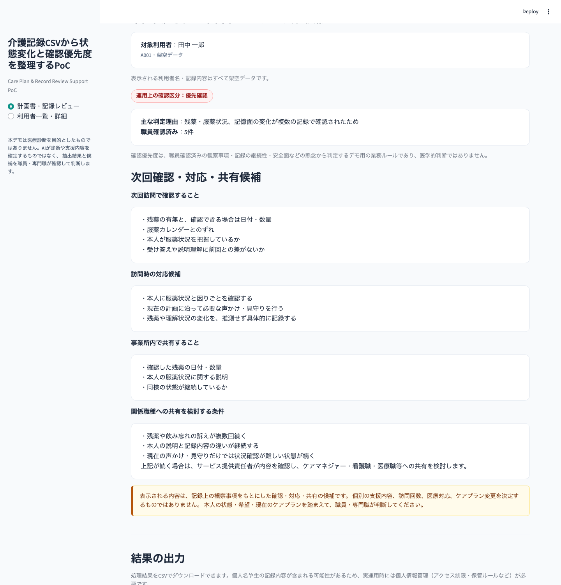
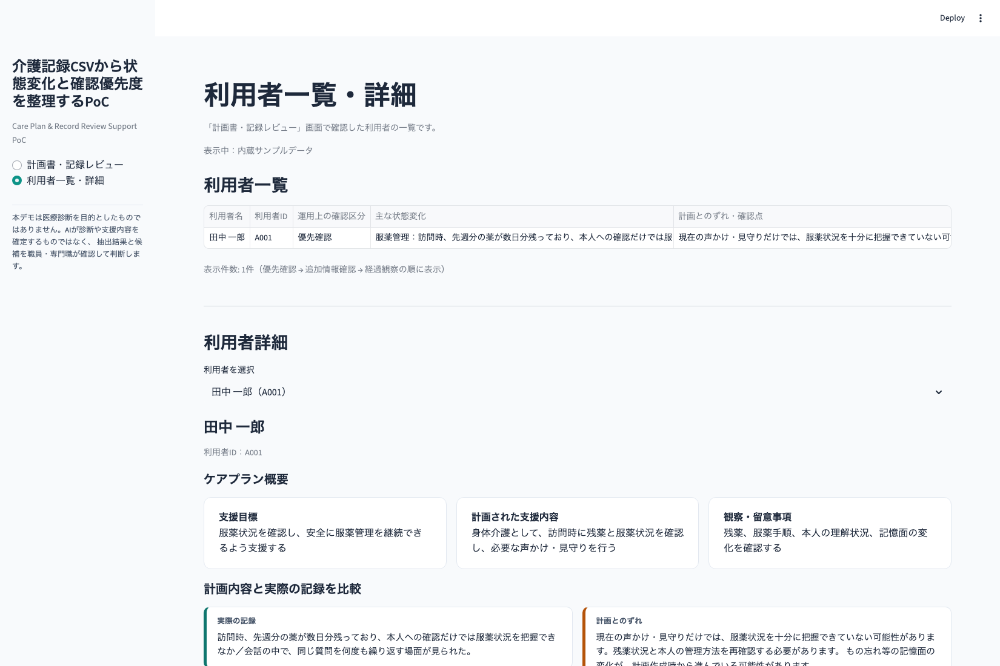

# 計画書と介護記録の差分から確認優先度を整理するPoC

Care Plan & Record Review Support PoC

訪問介護計画書、日々の介護記録、モニタリング記録を利用者単位で統合し、計画内容と実際の記録との差や状態変化候補を整理するPoCです。抽出結果を職員が確認した後、運用上の確認区分と、次回確認・対応・共有候補を表示します。

- 現在の自動抽出は生成AIではなく、キーワードと業務ルールを用いたルールベース処理です
- 医療診断は行いません
- 個別の支援内容を自動決定しません
- ケアプラン変更を確定しません
- 最終判断は職員・専門職が行います
- 公開デモの利用者名・記録内容はすべて架空データです
- 現在はCSV取込によって外部データ連携を再現しています

<p align="center">
  
</p>

---

## 解決したい現場課題

### 記録が分散している
計画書、日々の介護記録、モニタリングを個別に確認する必要があり、状態変化を横断的に把握しにくい。

### 確認方法が属人化している
職員の経験によって、記録から読み取る内容や確認方法に差が生じる。

### 引継ぎ・共有内容にばらつきがある
何を確認し、どの事実を共有するかが職員によって異なる。

## このPoCで行うこと

```
CSV取込
 → 計画書・記録・モニタリングを利用者単位で統合
 → 状態変化候補をルールベースで抽出
 → 職員が採用・修正・対象外を確認
 → 運用上の確認区分を整理
 → 次回確認・対応・共有候補を表示
 → 結果CSVを出力
```

## 3分で確認できる見どころ

1. 内蔵サンプルデータを選択する
2. A001またはU101を選択する
3. ケアプラン概要と日々の記録を確認する
4. 計画内容と実際の記録の比較を見る
5. 「観察事項を抽出」を実行する
6. 採用・内容を整えて採用・対象外を確認する
7. 運用上の確認区分と次回確認・対応・共有候補を見る
8. 利用者一覧・詳細で複数利用者を比較する
9. 必要に応じて結果CSVをダウンロードする

<p align="center">
  
</p>

## 主な機能

- 内蔵サンプルデータ（A001〜D001）
- CSVアップロード（U101〜U103のCSV取込確認用サンプルを同梱）
- 文字コード判定
- 列名マッピング（別名の列名をアプリ内の標準列へ変換）
- 必須項目・利用者ID・日付の確認
- 計画書と実際の記録の比較（計画とのずれの表示）
- ルールベースによる観察候補抽出
- 抽出根拠の表示（一致したキーワードと適用カテゴリ）
- 職員による採用／内容を整えて採用／対象外の判断
- 運用上の確認区分（優先確認／追加情報確認／経過観察）の表示
- 次回確認・対応・共有候補の表示
- 利用者一覧・詳細（複数利用者の比較）
- 結果CSVの出力
- サンプルモードとCSVアップロードモードのセッション状態分離

## サンプルケース

| 利用者ID | 主なケース | 想定区分 |
|---|---|---|
| A001 | 服薬管理・残薬・記憶面の変化 | 優先確認 |
| B001 | 排泄・皮膚状態の変化 | 優先確認 |
| C001 | 口腔ケアの軽微な変化 | 経過観察 |
| D001 | 記録はあり、状態変化候補なし | 経過観察 |
| U101 | 移動・立ち上がり・介助量の変化 | 優先確認 |
| U102 | 口腔ケアの軽微な変化 | 経過観察 |
| U103 | 記録・モニタリング情報不足 | 追加情報確認 |

A001〜D001は内蔵サンプルデータ、U101〜U103はCSVアップロードモードのCSV取込確認用サンプルです。

D001とU103は一見似ていますが、意味が異なります。

- **D001**：必要な記録は存在し、今回の抽出ルールでは明確な状態変化候補が検出されなかったケース
- **U103**：状態変化を判断するための記録・モニタリング情報が不足しているケース

「状態変化候補なし」と「情報不足」は区別して表示しています。

<p align="center">
  
</p>

## 処理ロジック

1. CSVの文字コードを判定して読み込む
2. 異なる列名をアプリ内の標準列へ変換する
3. 必須項目や日付、利用者IDを確認する
4. 利用者ID単位で計画書・記録・モニタリングを統合する
5. キーワードと業務ルールで状態変化候補を抽出する
6. 職員が採用・修正・対象外を判断する
7. 職員確認済みの情報から運用上の確認区分を整理する
8. 次回確認・対応・共有候補を表示し、結果CSVを出力する

現在の抽出処理は、生成AIによる自由推論ではなく、説明可能性を重視したルールベース処理です。

## 運用上の確認区分

- **優先確認**：安全面・服薬管理の懸念や、複数カテゴリの状態変化が記録で確認されたケース
- **追加情報確認**：状態変化を判断するための記録・モニタリング情報が不足しているケース
- **経過観察**：現時点で優先確認・追加情報確認のいずれにも該当しないケース

いずれも医療リスクや診断結果ではなく、職員が記録を確認する順番や、追加情報の必要性を整理するための業務上の区分です。

## 人間による確認

抽出された観察候補には、職員が次の3つから判断します。

- **採用**：抽出内容をそのまま確認済みとする
- **内容を整えて採用**：文言を整えたうえで確認済みとする
- **対象外**：確認済み観察事項として扱わない

「対象外」とした候補は、確認優先度の判定・次回確認候補・確認済み観察事項CSVのいずれにも反映されません。ルールベース処理が結果を自動確定するのではなく、職員が内容を確認したうえで反映するHuman-in-the-loop設計です。

## 次回確認・対応・共有候補

職員確認済みの観察カテゴリから、次の4区分でルールベースの候補を表示します。

- **次回訪問で確認すること**：まだ確認できていない、次回訪問時の確認候補
- **訪問時の対応候補**：現在のケアプランの範囲内での関わり方の候補
- **事業所内で共有すること**：記録で確認できた事実
- **関係職種への共有を検討する条件**：今後の共有を検討する目安となる条件

- 記録された事実と、未確認事項を区別して表示しています
- 本人主体の確認・対応候補を表示します
- 現在のケアプランの範囲を超える支援は自動決定しません
- 医療対応やケアプラン変更を指示しません
- 候補数を絞り、主な状態変化カテゴリを優先して表示します

<p align="center">
  
</p>

## CSV出力

- **review_priority_results.csv**：利用者ごとの確認結果一覧。`user_id` / `user_name` / `operational_priority`（運用上の確認区分） / `priority_reason`（主な判定理由） / `main_change` / `source_type` / `source_date` / `input_information_status` / `missing_information_detail` / `review_status` / `planned_support` / `actual_record_summary` / `plan_record_gap` / `next_visit_checks`（次回訪問で確認すること） / `visit_action_candidates`（訪問時の対応候補） / `office_share_items`（事業所内で共有すること） / `external_share_conditions`（関係職種への共有を検討する条件）を含みます。
- **confirmed_observations.csv**：職員確認済みの観察事項一覧。`user_id` / `user_name` / `observation_category` / `confirmed_observation` / `evidence_text` / `record_date` / `source_type` / `staff_decision` を含みます。

個人名や生の記録内容が含まれる可能性があるため、実運用時には個人情報管理（アクセス制限・保管ルールなど）が必要です。

<p align="center">
  
</p>

## 職員・専門職が判断すること

本PoCは、計画書と記録から確認材料を整理するものです。本人の状態・希望・現在のケアプランを踏まえた最終判断は、職員・専門職が行います。

- 医療上の診断や判断
- 個別支援方法の決定
- ケアプラン変更の確定
- 服薬方法や医療対応の指示
- 抽出結果の採否
- 記録や支援内容への最終反映

## 現在のPoCでは未実装の機能

- 特定介護ソフトとの自動連携
- データベースへの永続保存
- 認証・権限管理
- 監査ログ
- 業務チャットへの通知
- 実利用者データを用いた運用検証

公開デモでは実利用者データを使用していません。

## 将来構想

いずれも現在は未実装の構想です。

- 介護記録ソフトのAPI連携
- 定期ファイル連携
- 記録画面から対象利用者レビューへの直接遷移
- 利用者・訪問予定・ケアプラン・直近記録に応じた確認項目の提示
- 多言語表示・やさしい日本語への変換（翻訳後も職員確認を必須とする設計）
- 認証・権限管理・監査ログ
- 職員確認済み内容の業務チャット連携

---

<details>
<summary>開発の出発点：認知症リスク予測モデル</summary>

本PoCは、Kaggleの公開データを用いたRandomForestClassifierによる認知症リスク予測モデルの検討から始まりました。

- Kaggleの公開データ（Alzheimer's Disease Dataset）でRandomForestClassifierモデルを構築
- 見逃し（False Negative）を抑えるための閾値調整、確率校正（Calibration）、特徴量重要度分析を実施
- 交差検証（5-fold）：Accuracy 約0.93、Recall 約0.85
- 確率校正（Brier Score）：校正前 0.078 → 校正後 0.054 に改善
- 特徴量重要度：MMSE・ADL・FunctionalAssessmentが上位（介護現場の実感と整合）
- MMSE、ADL、FunctionalAssessment等の構造化評価値が判定に重要であることを確認

一方で、訪問介護の現場ではこれらの構造化評価値を継続的に取得しにくいという課題があると判断し、現場で日々蓄積される計画書・介護記録・モニタリングを活用する方向へ転換しました。その結果として発展したのが、現在の計画書・記録レビューPoCです。

分析の詳細（Notebook・分析スクリプト・サマリー資料）は次のとおりです。

- 分析Notebook：[notebook/dementia_risk_prediction.ipynb](notebook/dementia_risk_prediction.ipynb)
- 分析スクリプト：[src/dementia_risk_prediction.py](src/dementia_risk_prediction.py)
- サマリー資料（PDF）：[docs/dementia_risk_prediction_slides.pdf](docs/dementia_risk_prediction_slides.pdf)

モデルの学習資産（`models/`）と評価指標（`outputs/`）はリポジトリにそのまま残しています。

</details>

## 技術スタック

- Python
- Streamlit
- pandas
- numpy
- scikit-learn / joblib（開発の出発点である認知症リスク予測モデルの学習資産を保持するために使用）
- matplotlib（同上）

現在公開している計画書・記録レビューPoCの画面は、Streamlitとpandasによるルールベース処理で構成されています。

## ローカル実行方法

```bash
git clone <repository-url>
cd dementia-risk-prediction
python3 -m pip install -r requirements.txt
python3 -m streamlit run app.py
```

## ディレクトリ構成

```
dementia-risk-prediction/
├── app.py                      # Streamlitアプリ本体
├── README.md
├── requirements.txt
├── data/
│   ├── sample_users.csv            # 内蔵サンプル（利用者基本情報）
│   ├── sample_care_plans.csv       # 内蔵サンプル（訪問介護計画書）
│   ├── sample_daily_records.csv    # 内蔵サンプル（日々の介護記録）
│   ├── sample_monitoring_records.csv # 内蔵サンプル（モニタリング記録）
│   ├── column_aliases.json         # 列名マッピング定義
│   └── upload_demo/                # CSV取込確認用データ（U101〜U103）
├── docs/
│   ├── screenshots/                 # 公開用スクリーンショット
│   └── dementia_risk_prediction_slides.pdf
├── notebook/                    # 認知症リスク予測モデルの分析Notebook
├── models/                      # 認知症リスク予測モデルの学習資産
└── outputs/                     # 認知症リスク予測モデルの評価指標

```

---

本プロジェクトは、訪問介護職として培った現場感覚と、データ分析・ソフトウェア開発のスキルを接続することを目的とした個人ポートフォリオです。ITコンサルタントへのキャリアチェンジにあたり、「現場課題の理解」と「業務を整理する仕組みの設計」の両方に取り組めることを示すことを狙いとしています。
